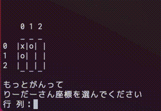

# 新入生プログラミング学習

## このページは何？

音響工学プロジェクトに入った新入生向けて
C言語の学習用のテキストとサンプルプログラムをこのサイト（Github）上で随時更新していきます．

## この学習の目標

C言語で三目並べ（マルバツゲーム）を作成してもらいます．

## 目次

1. C言語の開発環境構築
   1. [Windowsの方法](c_setting/windows.md)
   1. [Macの方法](c_setting/mac.md)
1. C言語入門
   1. [C言語に慣れる](/2_1/c_pro01.md)
   1. [変数とキーボード入力](2_2/c_pro02.md)
   1. [いろんな演算と型](2_3/c_pro03.md)
1. 条件分岐
   1. if文
   1. for文
   1. while文
   1. do文
   1. swich文

## おすすめの参考書，参考サイト

* [新・明解C言語 入門編 (明解シリーズ)   柴田 望洋](https://www.amazon.co.jp/dp/479737702X/ref=cm_sw_r_tw_dp_TGSERK5TFNCC2Z9XE9AD)
* [苦しんで覚えるＣ言語](https://9cguide.appspot.com/)

## 音響工学プロジェクト連絡先

[twitter](https://twitter.com/niigata_onkyo)
