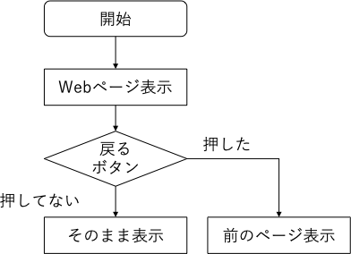

# if文

アプリを使用しているときなど意識はしたことはないと思いますが，プログラムでは色々な条件分岐というものをしています．

例えば「ブラウザで戻るボタンを押すと前のページに戻る」など当たり前のように感じる一連の動作がありますが，これは「もしも戻るボタンが押されたら前のページにもどる．もし押されていない場合は待機する」というようになっています．



図示すると上のようになります．このような図をフローチャートといいます．図のひし形の部分を条件分岐といいます．

## if文のプログラム

上のようにボタンの状態で動きが変わるものの一つにif文というものがあります．
ここでは「もし入力した値が奇数ならhelloと表示する」というプログラム[if_odd.c](if_odd.c)を作成します．

```c
#include <stdio.h>

int main(void)
{
    int n;

    printf("整数を入力してください：");
    scanf("%d", &n);

    if (n % 2)     //条件分岐「もしも奇数なら波カッコ内を実行」
    {
        printf("値は奇数\n");
    }

    return 0;
}
```

実際に実行してみると奇数を入力したときは「値は奇数」と表示され，偶数を入力したときは何も表示されずプログラムは終了します．

プログラムを見ると

```c
if(n % 2)
{
    printf("値は奇数\n");
}
```

という部分があると思います．この部分が「もし入力した値が奇数なら「値は奇数」と表示する」という条件分岐です．

if文は

```c
if(制御式)
{
    //プログラム
}
```

のように書きます．

if文は制御式の値が0でない場合に波カッコ内のプログラムを実行します．

[if_odd.c](if_odd.c)の場合は

```c
n % 2
```

という制御式があり，偶数のときは余りが0になり波カッコ内のプログラムは実行されず，奇数のときは余りが1になるため波カッコないのプログラムが実行されるため，奇数が入力されると「値は奇数」と表示するようになる．

## について

if文
